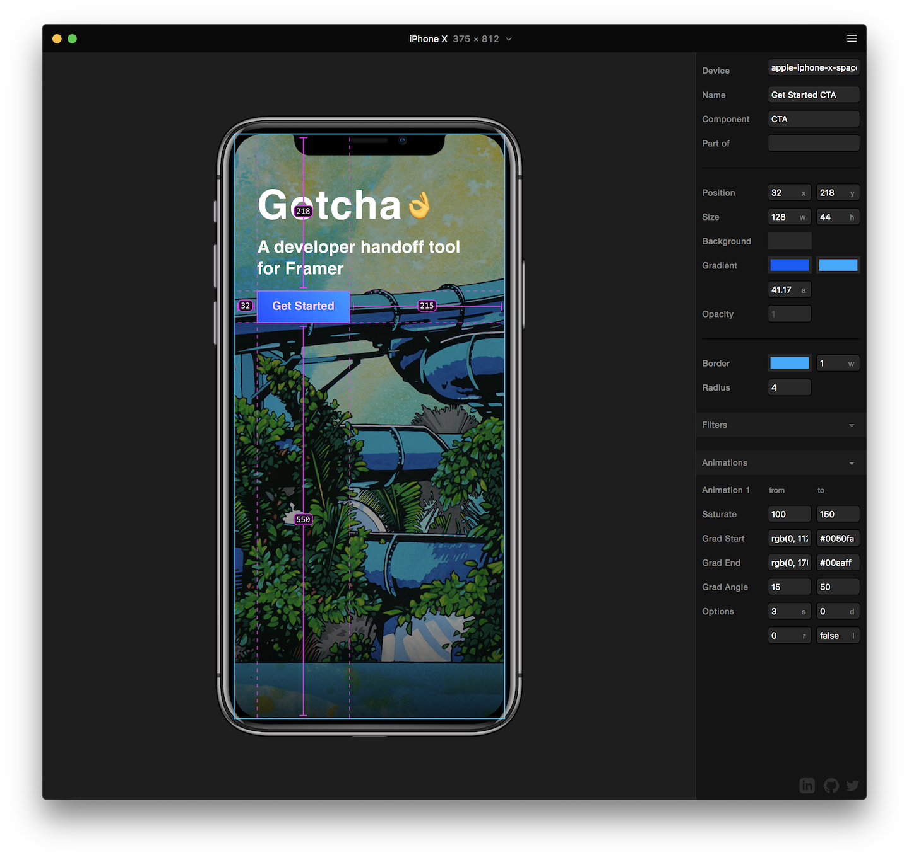

<h1 align="center">
   
  Gotcha 👌 
   
</h1>
 

  
	
	 
	<h6 align="center">INTRODUCTION</h6>
	

	  	Press a key and your <a href="http://framer.com">Framer</a> prototype becomes its own live, self-documenting, developer-ready spec.  When enabled, Gotcha provides precise information about your project's elements: from positions and colors to font styling and even component names and relationships. Best of all, Gotcha works seamlessly with Framer Cloud, so the links you send can work as specs, too.  <a href="https://framer.cloud/OPNdS"><b>Check out the demo.</b></a>
	

 

## Installation

 
 

To install manually, download the **gotcha.coffee** file and drag it into your project's code editor.

## Usage

In the Preview window...
- Hover a Layer to get information about it
- Tap a Layer to select it

On your keyboard...
- Press *`* or *<* to enable or disable Gotcha
- Press */* or *>* to select or deselect a Layer
- Press *.* to simulate a tap on a hovered Layer
- Press \ to pause all animations

In the spec panel...
- click any field to copy the field's value
- Slow down the global animation speed using the Speed slider
- Change devices using the Devices dropdown

## Tips

- Gotcha works in the Device Preview window. If your preview window is zoomed in, or if you can't see a device, you'll need to select the Toggle Device from the window's hamburger menu, or press Command + Shift + D.
- Be sure that your Device Preview window is active before pressing any keys, lest you find your code full of random tick marks.

## Planned Features

- Copy formatted CSS from the spec panel.
- Give your components custom properties to display.

## Contact

- Follow me at <a href="https://twitter.com/steveruizok">@steveruizok</a>
